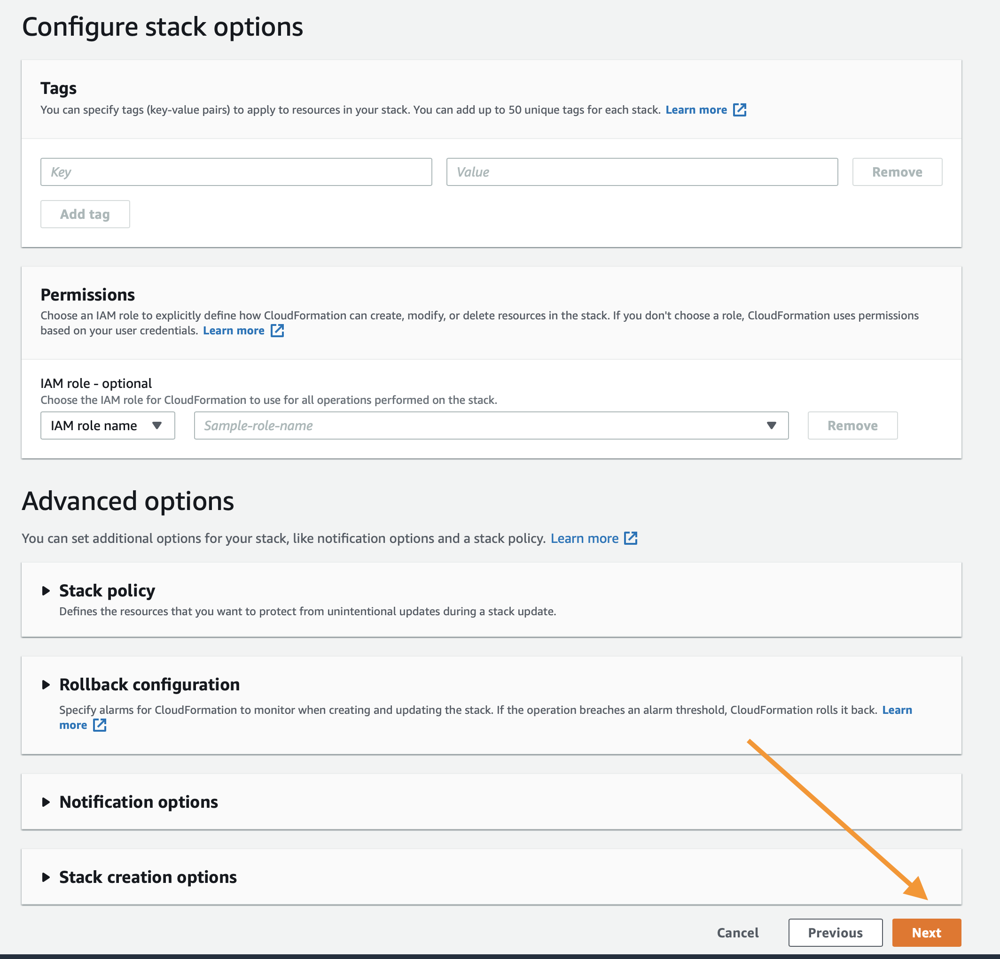

## Amazon Personalize Immersion Day

This goal of this Immersion Day is to provide a common starting point for learning how to use the various features of [Amazon Personalize](https://aws.amazon.com/personalize/). 

For detailed specifics of any concept mentioned look at the [Personalize developer guide](https://docs.aws.amazon.com/personalize/latest/dg/what-is-personalize.html)

In the Notebooks you will learn to:

1. Prepare a dataset for use with Amazon Personalize.
1. Build models based on that dataset.
1. Evaluate a model's performance based on real observations.

## Agenda

The steps below outline the process of building your own time-series prediction models, evaluating them, and then cleaning up all of yuour resources to prevent any unwanted charges. To get started execute the following steps.

1. Deploy the CloudFormation Template below or build a local Jupyter environment with the AWS CLI installed and configured for your IAM account.
1. This [personalize_hrnn_metadata_contextual_example.ipynb](personalize_hrnn_metadata_contextual_example.ipynb) shows how these useful information can be uploaded to our system to aid recommendation. A caveat is that the improvements of meta-data recipes depend on how much information can be extracted from the provided meta-data.

## Prerequisites 

1. An AWS Account
1. A user in the account with administrative privileges

## Outline

1. First you will deploy a CloudFormation template that will create an S3 bucket for data storage, a SageMaker Notebook Instance where the exercises are executed, IAM policies for the Notebook Instance, and it will clone this repository into the Notebook Instance so you are ready to get started.
1. Next you will open the `personalize_hrnn_metadata_contextual_example.ipynb` to get started.
1. This notebook will guide you through the process of the other notebooks until you have a working and evaluated Amazon Personalize.

## Building Your Environment:

As mentioned above, the first step is to deploy a CloudFormation template that will perform much of the initial setup work for you. In another browser window or tab, login to your AWS account. Once you have done that, open the link below in a new tab to start the process of deploying the items you need via CloudFormation.

Follow along with the screenshots below if you have any questions about deploying the stack.

### Cloud Formation Wizard

Start by clicking `Next` at the bottom like this:

On this page you have a few tasks:

1. Change the Stack name to something relevant like `PersonalizePOC`
1. Change the Notebook Name (Optional)
1. Alter the VolumeSize for the SageMaker EBS volume, default is 10GB, if your dataset is expected to be larger, please increase this accordingly.

When you are done click `Next` at the bottom.

This page is a bit longer, so scroll to the bottom to click `Next`. All of the defaults should be sufficient to complete the POC, if you have custom requirements, alter as necessary.

Again scroll to the bottom, check the box to enable the template to create new IAM resources and then click `Create Stack`.

For a few minutes CloudFormation will be creating the resources described above on your behalf it will look like this while it is provisioning:

Once it has completed you'll see green text like below indicating that the work has been completed:

Now that your environment has been created go to the service page for SageMaker by clicking `Services` in the top of the console and then searching for `SageMaker` and clicking the service.

From the SageMaker console, scroll until you see the green box indicating now many notebooks you have in service and click that.

On this page you will see a list of any SageMaker notebooks you have running, simply click the `Open JupyterLab` link on the Personalize POC notebook you have created

This will open the Jupyter environment for your POC; think of it as a web based data science IDE if you are not familiar with it. 

On your left hand side please navigate to the following directory `amazon-personalize-samples/workshops/Immersion_Day/` and double click the `personalize_hrnn_metadata_contextual_example.ipynb` notebook.